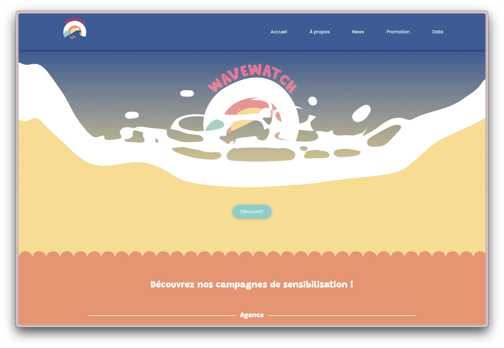

# Projet Transversal IIM - Surf aux JO 2024 & Enjeux Environnementaux

## Présentation du projet

Ce projet transversal a été réalisé en collaboration avec plusieurs axes de l'IIM (Institut de l'Internet et du Multimédia) :
- Développement Web
- Design
- Web Marketing
- Jeu Vidéo
- 3D

L'objectif principal était de créer un site web mettant en lumière les enjeux environnementaux liés à l'épreuve de surf des Jeux Olympiques de Paris 2024. Le site intègre également une base de données permettant d'afficher les scores des joueurs du jeu vidéo développé par l'axe Jeu Vidéo.

## Aperçu du site



*Remplacez l'URL ci-dessus par le lien vers votre capture d'écran du site*

## Fonctionnalités

- Présentation des enjeux environnementaux du surf aux JO 2024
- Interface utilisateur intuitive et responsive
- Base de données pour le stockage et l'affichage des scores du jeu
- Intégration des éléments visuels créés par les axes Design et 3D
- Stratégie de communication développée par l'axe Web Marketing

## Prérequis

Pour faire fonctionner ce projet, vous aurez besoin de :
- Un serveur local (MAMP, XAMPP, WAMP, etc.)
- Un gestionnaire de base de données MySQL

## Installation

1. Clonez ce dépôt sur votre machine locale :
   ```
   git clone https://github.com/emoliie/IIMA1_projet-transversal.git
   ```

2. Configurez votre serveur local (ex: MAMP) pour pointer vers le dossier du projet

3. Configuration de la base de données :
   - Créez une nouvelle base de données dans votre système de gestion de base de données
   - Importez le fichier SQL fourni dans le dossier `database` (si disponible)
   - Configurez les paramètres de connexion à la base de données dans le fichier de configuration approprié

4. Accédez au projet via votre navigateur en utilisant l'URL locale configurée

## Contribution

Ce projet a été réalisé en collaboration avec différents axes de l'IIM, chacun apportant son expertise :
- **Développement Web** : Création du site web et intégration de la base de données
- **Design** : Conception de l'interface utilisateur et des éléments graphiques
- **Web Marketing** : Stratégie de communication et référencement
- **Jeu Vidéo** : Développement du jeu lié à la thématique du surf
- **3D** : Création d'éléments visuels en trois dimensions

## Mon rôle

Mon rôle dans ce projet était de développer le site web présentant les enjeux environnementaux de l'épreuve de surf des JO 2024 de Paris et d'intégrer la base de données permettant d'afficher les scores des joueurs du jeu créé par l'axe Jeu Vidéo.

## Licence

Ce projet est réalisé dans le cadre d'un projet académique à l'IIM.